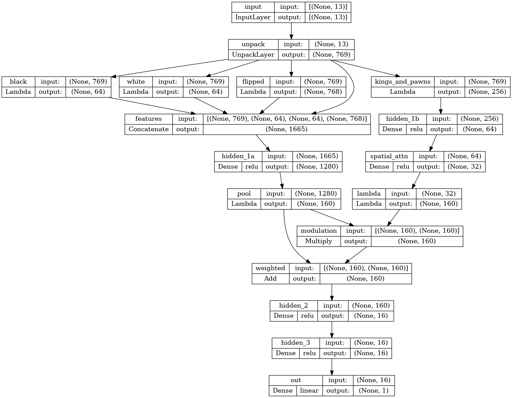

# Sturddle 2

Sturddle 2 is a fork of my Sturddle Chess Engine (https://github.com/cristivlas/sturddle-chess-engine)
with many bug fixes and a rewritten (and trained from scratch) neural network.

## Building the Engine

Python (3.9 or higher) and a working C++ compiler are required. The compiler must support
the C++ 20 standard. Clang 16 or higher is recommended (clang-cl.exe on Windows).
The GNU C++ compiler and the Microsoft Compiler may work but are not well tested.

The Python libraries in requirements.txt must be installed.

To build a self-contained executable, PyInstaller is also needed. It is recommended to use a Python
virtual environment for building.

<code>python3 tools\build.py</code> builds a native executable for the host OS.

On x64_64, the executable bundles binary images that support AVX512, AVX2, AVX, VNNI, and generic SSE2.
At runtime, a "bootstrap" python scripts selects the right engine module based on processor features.

To build just a python module:
<code>python3 setup.py build_ext --inplace</code>
or:
<code>CC=clang++ CFLAGS=-march=native python3 setup.py build_ext --inplace</code>

# Neural Net Architecture
This version of the engine uses my original **Bluejay** architecture. It retains the "spatial attention" brilliant
design of previous versions, but changes the activation to linear, and it introduces a "bucket shifting" layer.

*NOTE*: Some internal details omitted for simplicity.

Inference runs on the CPU using vectorized instructions.
The x86_64 and ARM64 with NEON architectures are supported.
To enable half precision on ARM processors that support it, set CXXFLAGS or CFLAGS:
CFLAGS="march=armv8.2-a+fp16"

## Tuning the Engine
There are two ways to tune parameters defined in `config.h`:
- Using https://chess-tuning-tools.readthedocs.io/en/latest/
- or using the Lakas optimizer https://github.com/fsmosca/Lakas

1) Install the preferred tool and `cutechess-cli`.

2) Edit the `config.h` file, and replace `DECLARE_VALUE` with `DECLARE_PARAM` for the parameters to be tuned.
3) Build the python module:
<code>CC=clang++ CFLAGS=-march=native NATIVE_UCI=1 python3 setup.py build_ext --inplace</code>
Run `./main.py`, and enter the `uci` command. The parameters of interest should be listed in the output.
Quit the engine.

*NOTE*: the **NATIVE_UCI** flag is no longer required, older version used a Python implementation of the UCI protocol,
the default is now to use the "native" C++ implementation.

4) Run `tuneup/gentune.py` to generate a JSON configuration file for chess-tuning-tools, or
`tuneup/genlakas.py` to generate a wrapper script to invoke the Lakas optimizer.

5) Run the optimizer. Once the optimizer converges, edit the `config.h` file, and change the values
of the parameters; change `DECLARE_PARAM` back to `DECLARE_VALUE`.

