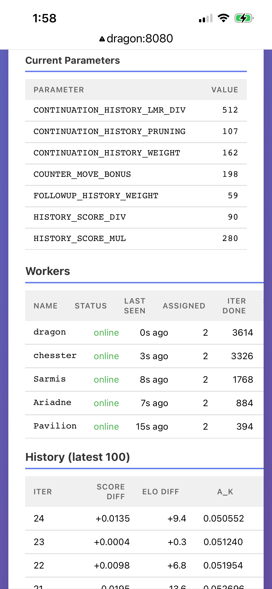
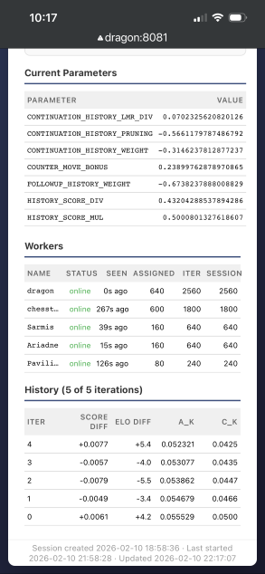
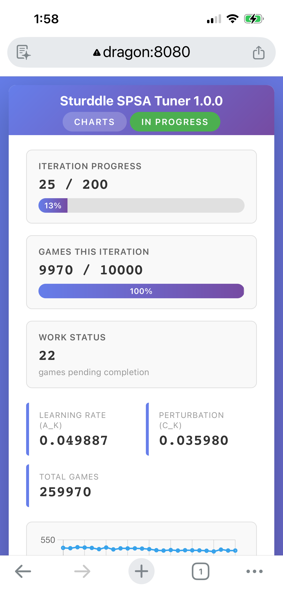

# Distributed SPSA Tuner

A distributed SPSA (Simultaneous Perturbation Stochastic Approximation) tuner
for the Sturddle chess engine, using cutechess-cli to run games. Designed for small
heterogeneous LANs, mixed Linux/Windows.

## Architecture

- **Coordinator**: HTTP server managing SPSA state. Generates perturbations,
  distributes work, collects scores, updates parameters. Tracks worker health
  via implicit heartbeat and adapts chunk sizes to worker throughput.
- **Workers**: Poll the coordinator for game batches, run cutechess-cli locally,
  report scores back. Each worker saves PGNs and logs locally.

## Prerequisites

- [cutechess-cli](https://github.com/cutechess/cutechess) installed on each worker machine
- Engine build prepped for tuning (see [Tuning the Engine](../../../README.md#tuning-the-engine) in the main README)

**Windows stack size caveat**: Using `main.py` directly (via the `engine.bat`
wrapper) is convenient because it avoids a full packaged build, but `python.exe`
has a limited default stack. At higher search depths this can cause stack
overflows in the C extension. On Linux, thread stacks grow on demand so this
is not an issue. If you see crashes on Windows, use a full build instead (see
`tools/build.py`) — it configures a sufficiently large stack for the executable.

## Quick Start (single machine)

### 1. Generate a tuning project

From the repo root:

```bash
python tools/tuneup/spsa/genconfig.py my-test -D 8 -i 50 -g 100
```

This creates `tuneup/my-test/` with:
- `tuning.json` — session config (parameters, SPSA settings, search control)
- `worker.json` — local worker config (engine path, book, concurrency)
- `engine.bat` — engine wrapper (Windows only)

Options:
- First argument is the project name
- `all` (default) — tune all parameters, or list specific names
- `-D` — fixed search depth (mutually exclusive with `-t`)
- `-t` — time control, e.g. `1+0.1` (default)
- `-H` — hash table size in MB (default: 256)
- `-T` — engine threads (default: 1)
- `-i` — number of SPSA iterations (default: 100)
- `-g` — games per SPSA iteration (default: 100)
- `-c` — SPSA perturbation as fraction of range (default: 0.05 = 5%)
- `-a` — SPSA learning rate (default: 0.5)

### 2. Review and edit configs

Open `tuneup/my-test/tuning.json` and adjust:
- Remove parameters you don't want to tune
- Adjust bounds (`lower`/`upper`) if needed
- Tweak SPSA hyperparameters (`a`, `c`, etc.)

Open `tuneup/my-test/worker.json` and verify:
- `engine` path is correct
- `opening_book` path is correct (defaults to `tuneup/books/8moves_v3.pgn`)
- `concurrency` matches your CPU count
- `cutechess_cli` is in your PATH (or set full path)
- `parameter_overrides` for machine-specific options (e.g., `SyzygyPath`)

### 3. Start the coordinator

```bash
cd tuneup/my-test
python ../../tools/tuneup/spsa/coordinator.py -c tuning.json
```

### 4. Start a worker (separate terminal)

```bash
cd tuneup/my-test
python ../../tools/tuneup/spsa/worker.py -c worker.json
```

The worker connects, fetches the tuning session, and starts playing games.

## Multi-Machine Setup

### Coordinator machine

```bash
cd tuneup/my-test
python ../../tools/tuneup/spsa/coordinator.py -c tuning.json -p 8080
```

The coordinator binds to `0.0.0.0:8080` and accepts connections from any worker.

### Each worker machine

1. Copy or create a `worker.json` with machine-specific paths:

```json
{
  "coordinator": "http://192.168.1.10:8080",
  "engine": "/home/user/engines/sturddle/main.py",
  "cutechess_cli": "/usr/local/bin/cutechess-cli",
  "concurrency": 8,
  "opening_book": "/home/user/books/8moves_v3.pgn",
  "book_format": "pgn",
  "book_depth": 8,
  "games_dir": "/home/user/spsa/my-test/games",
  "log_file": "/home/user/spsa/my-test/logs/worker.log",
  "parameter_overrides": {
    "SyzygyPath": "/home/user/syzygy/3-4-5/"
  }
}
```

2. Start the worker:

```bash
python /path/to/tools/tuneup/spsa/worker.py -c worker.json
```

Workers can come and go freely. The coordinator tracks each worker's throughput
and adapts chunk sizes proportionally — faster machines get more work.

## Dashboard

Open `http://coordinator-ip:8080/` in a browser for a live dashboard showing:
- Overall progress and current iteration
- Current parameter values
- Worker status (online / timed out, assigned and completed work etc.)
- Recent iteration history with score and ELO diffs
- Parameter convergence charts

The dashboard auto-refreshes using Server-Sent Events (SSE) and failover to an
interval set by `dashboard_refresh` in tuning.json.

<table><tr>
<td></td>
<td></td>
<td></td>
</tr></table>

## Monitoring

### Coordinator logs

The coordinator logs iteration progress with parameter step sizes:

```
============================================================
Iteration 5 complete (100 games)
Scores: +0.5250 / -0.4750 (diff: +0.0500, ELO diff: +34.8)
Updated parameters:
  NULL_MOVE_MARGIN: 65.0000 -> 68.1200 (engine: 68, step: +3.1200, 7.8% of range)
Worker stats:
  dragon: 72 games, 0.85 games/sec
  ariadne: 28 games, 0.33 games/sec
============================================================
```

### Status endpoint

```bash
curl http://localhost:8080/status
```

Returns JSON with current iteration, parameter values, worker stats, and progress.

## Resuming and Clean Start

Resume is the default. Restarting the coordinator picks up from the last
completed iteration (`spsa_state.json`). Workers reconnect automatically.

```bash
python ../../tools/tuneup/spsa/coordinator.py -c tuning.json
```

To wipe state and logs, start fresh:
```bash
python ../../tools/tuneup/spsa/coordinator.py -c tuning.json --clean
```

Worker logs can also be cleaned:
```bash
python ../../tools/tuneup/spsa/worker.py -c worker.json --clean
```

### Live-Patching via Restart (Linux)

On Linux, pressing Ctrl+C during a Coordinator run offers a **restart** option (`r`) that
drains the current iteration, saves state, then re-execs the coordinator
process via `os.execv`. Because the new process re-reads `tuning.json` and
reloads all Python modules from disk, this allows live-patching of a running
tuning session without losing progress:

1. Edit `tuning.json` (e.g. change `work_stealing`, etc.)
   and/or modify coordinator source code.
2. Press Ctrl+C in the coordinator terminal.
3. Choose `r` (restart). The coordinator waits for the current iteration to
   finish, checkpoints, and restarts with the updated code and config.

Workers are unaffected — they simply retry until the new coordinator comes up
(governed by `http_retry_timeout`, default 300s). This is not available on
Windows because `os.execv` does not replace the process in-place there.

## Debug Mode

For verbose worker output (all cutechess-cli score lines, full output):
```bash
python ../../tools/tuneup/spsa/worker.py -c worker.json --debug
```

## Project Directory Layout

After a tuning run, a project directory looks like:

```
tuneup/my-test/
  tuning.json           # session config
  worker.json           # local worker config
  engine.bat            # engine wrapper (Windows)
  spsa_state.json       # checkpoint (auto-generated)
  logs/
    coordinator.log     # iteration results, parameter updates
    worker.log          # worker activity log
  games/
    games.pgn           # all PGNs (appended by cutechess-cli)
```

## Configuration Reference

### tuning.json (session-level, shared)

| Field | Description | Default |
|---|---|---|
| `engine.protocol` | Engine protocol | `"uci"` |
| `engine.fixed_options` | Fixed UCI options (Hash, Threads, etc.) | `{}` |
| `time_control` | Time control string | `"1+0.1"` |
| `depth` | Fixed search depth (overrides time_control if set) | `null` |
| `games_per_iteration` | Games per SPSA iteration | `100` |
| `output_dir` | Coordinator output (logs, checkpoint) | project dir |
| `retry_after` | Worker retry interval in seconds | `5` |
| `dashboard_refresh` | Dashboard auto-refresh in seconds | `10` |
| `dashboard_history` | Max iteration history entries sent to dashboard (0 = unlimited) | `100` |
| `work_stealing` | Reclaim chunks from slow workers for fast idle ones | `true` |
| `overdue_factor` | Multiplier on expected duration to declare a chunk overdue | `2.0` |
| `worker_idle_timeout` | Seconds before an idle worker (no chunks) is considered dead | `120.0` |
| `chunk_timeout_multiplier` | Multiplier on expected duration for chunk timeout | `5.0` |
| `min_chunk_timeout` | Minimum chunk timeout in seconds | `60.0` |
| `static_dir` | Directory for static assets (favicon, etc.); empty = disabled | `""` |
| `spsa.budget` | Total games budget (iterations * games_per_iteration) | `10000` |
| `spsa.a` | Learning rate | `0.5` |
| `spsa.c` | Perturbation as fraction of parameter range | `0.05` |
| `spsa.A_ratio` | Stabilization constant (fraction of max iterations) | `0.1` |
| `spsa.alpha` | Learning rate decay exponent | `0.602` |
| `spsa.gamma` | Perturbation decay exponent | `0.101` |
| `parameters.<name>.init` | Initial value | -- |
| `parameters.<name>.lower` | Lower bound | -- |
| `parameters.<name>.upper` | Upper bound | -- |
| `parameters.<name>.type` | `"int"` or `"float"` | `"int"` |

### worker.json (per-machine)

| Field | Description | Default |
|---|---|---|
| `coordinator` | Coordinator URL | `"http://localhost:8080"` |
| `engine` | Absolute path to engine (or wrapper script) | auto-detected |
| `cutechess_cli` | Path to cutechess-cli | `"cutechess-cli"` |
| `concurrency` | Concurrent games | CPU count |
| `opening_book` | Absolute path to opening book | auto-detected |
| `book_format` | Book format (`pgn` or `epd`) | `"pgn"` |
| `book_depth` | Opening book depth in plies | `8` |
| `games_dir` | Absolute path for PGN output | auto-detected |
| `log_file` | Absolute path to worker log | auto-detected |
| `max_chunk_size` | Hard cap on games per chunk (0 = unlimited) | `0` |
| `max_rounds_per_chunk` | Cap = concurrency × this × 2 (0 = unlimited) | `10` |
| `http_retry_timeout` | Seconds to retry on coordinator connection errors | `300` |
| `parameter_overrides` | Per-machine UCI engine options (e.g., SyzygyPath) | `{}` |
| `cutechess_overrides` | Per-machine cutechess-cli overrides (`tc`, `depth`) | `{}` |

## SPSA Algorithm

The tuner uses range-scaled SPSA with Bernoulli perturbations:

- Each iteration generates a random +/-1 vector delta
- Perturbation is scaled by parameter range: `c_k * delta * (upper - lower)`
- Two engine configs are created: `theta + perturbation` and `theta - perturbation`
- Games are played between them; scores estimate the gradient
- Update is scaled by range: `theta += a_k * gradient * (upper - lower)`
- This ensures consistent behavior across parameters with different ranges
- Learning rates decay: `a_k = a/(A+k+1)^alpha`, `c_k = c/(k+1)^gamma`
- Integer parameters are rounded after update but tracked as floats internally

## Work Distribution

The coordinator uses adaptive work assignment:

- **Chunk sizing**: The coordinator splits remaining games proportional to
  each worker's observed throughput (EWMA games/sec). New workers with no
  history get an equal share. Workers may cap chunk size locally via
  `max_chunk_size` (hard cap) and/or `max_rounds_per_chunk` (default 10,
  cap = concurrency × rounds × 2); if both are set the smaller wins. The
  worker sends this cap to the coordinator, which uses
  `min(adaptive, worker_cap)`. When the remainder is too small to split
  meaningfully the coordinator assigns it all to the requesting worker.
- **Adaptive timeout**: Chunk timeouts scale with expected completion time
  (5× multiplier, floor 60s, ceiling max(30min, largest-possible-chunk × 5)).
  See below for how game duration is estimated.
- **Worker tracking**: Workers are identified by hostname. The coordinator
  tracks each worker's throughput, games completed, and last-seen time.
  A worker is considered alive if it was seen within the worker timeout
  (max(120s, base_sec_per_game × 4)), or if it has a pending chunk that
  has not yet timed out. Timed-out workers' chunks are reclaimed.
- **Work stealing**: When a fast worker requests work but all games are
  assigned, the coordinator can reclaim a chunk from a slower worker and
  reassign it. This prevents fast workers from sitting idle while slow (or
  dead) workers hold chunks. Each chunk records its `expected_duration`
  at assignment time. A steal is allowed when either:
  - The holder is **overdue** (`elapsed > expected_duration`) and the
    stealer's estimated time for the chunk is less than `expected_duration`.
  - The stealer can finish the chunk before the holder's original deadline:
    `fast_total + elapsed < expected_duration`.

  Same-speed workers never steal from each other: in the non-overdue case
  the holder's head start makes the deadline impossible to beat; in the
  overdue case equal estimates block the steal. The slow worker continues
  running the stolen chunk, but its result is discarded (unknown chunk ID).
  Enabled by default; set `work_stealing: false` in `tuning.json` to
  disable.

### Timeout and Completion Estimates

The coordinator estimates per-game wall-clock time to drive chunk timeouts
and completion estimates. Three sources, in priority order:

1. **Observed EWMA speed** — after a worker completes its first chunk, the
   coordinator tracks an exponentially weighted moving average of games/sec.
   This is the primary signal and adapts to actual hardware speed.
2. **Worker cutechess overrides** — if a worker reports `cutechess_overrides`
   (see below) and has no EWMA data yet, the coordinator estimates from the
   worker's local `tc` or `depth` override.
3. **Tuning config defaults** — falls back to the session-level `time_control`
   or `depth` from `tuning.json`.

Duration heuristics:
- Time control `base+inc`: `2 * (base + 40 * inc)` seconds (both sides,
  assuming ~40 moves per game).
- Fixed depth `D`: `0.15 * 1.35^D` seconds (empirical exponential fit).

## Worker Overrides

Workers support two kinds of overrides for machine-specific differences:

### `parameter_overrides` — UCI engine options

Override or add UCI options sent to the engine. Useful for paths or settings
that vary per machine. These are applied as `option.Name=value` arguments
to cutechess-cli, after fixed options and tunable parameters.

```json
{
  "parameter_overrides": {
    "SyzygyPath": "/home/user/syzygy/3-4-5/"
  }
}
```

### `cutechess_overrides` — search control (tc/depth)

Override the session-level time control or search depth for this worker.
This is useful when workers have different hardware speeds and you want
finer control, or when testing locally at a different depth than the
session default.

```json
{
  "cutechess_overrides": {
    "depth": 6
  }
}
```

Or to override time control:

```json
{
  "cutechess_overrides": {
    "tc": "0.5+0.05"
  }
}
```

The worker sends these overrides to the coordinator on each work request,
so the coordinator can adjust its timeout estimates accordingly. This is
backwards compatible: old coordinators ignore the extra field, and old
workers that don't send overrides work unchanged with new coordinators.
