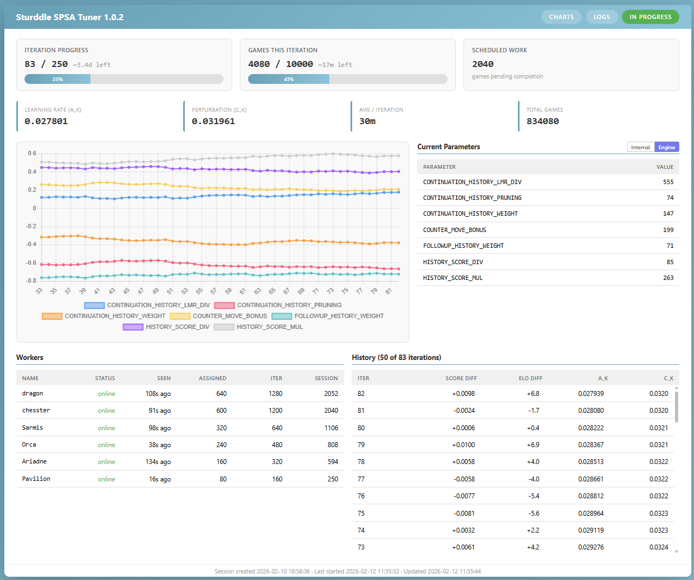

# Distributed SPSA Tuner

A distributed SPSA (Simultaneous Perturbation Stochastic Approximation) tuner
for the Sturddle chess engine, using cutechess-cli to run games. Designed for small
heterogeneous LANs, mixed Linux/Windows.

## Architecture

- **Coordinator**: HTTP server managing SPSA state. Generates perturbations,
  distributes work, collects scores, updates parameters. Tracks worker health
  via implicit heartbeat and adapts chunk sizes to worker throughput.
- **Workers**: Poll the coordinator for game batches, run cutechess-cli locally,
  report scores back. Each worker saves PGNs and logs locally.

## Prerequisites

- [cutechess-cli](https://github.com/cutechess/cutechess) installed on each worker machine
- Engine build prepped for tuning (see [Tuning the Engine](../../../README.md#tuning-the-engine) in the main README)

**Windows stack size caveat**: Using `main.py` directly (via the `engine.bat`
wrapper) is convenient because it avoids a full packaged build, but `python.exe`
has a limited default stack. At higher search depths this can cause stack
overflows in the C extension. On Linux, thread stacks grow on demand so this
is not an issue. If you see crashes on Windows, use a full build instead (see
`tools/build.py`) — it configures a sufficiently large stack for the executable.

## Quick Start (single machine)

### 1. Generate a tuning project

From the repo root:

```bash
python tools/tuneup/spsa/genconfig.py my-test -D 8 -i 50 -g 100
```

This creates `tuneup/my-test/` with:
- `tuning.json` — session config (parameters, SPSA settings, search control)
- `worker.json` — local worker config (engine path, book, concurrency)
- `engine.bat` — engine wrapper (Windows only)

Options:
- First argument is the project name
- `all` (default) — tune all parameters, or list specific names
- `-D` — fixed search depth (mutually exclusive with `-t`)
- `-t` — time control, e.g. `1+0.1` (default)
- `-H` — hash table size in MB (default: 256)
- `-T` — engine threads (default: 1)
- `-i` — number of SPSA iterations (default: 100)
- `-g` — games per SPSA iteration (default: 100)
- `-c` — SPSA perturbation as fraction of range (default: 0.05 = 5%)
- `-a` — SPSA learning rate (default: 0.5)

### 2. Review and edit configs

Open `tuneup/my-test/tuning.json` and adjust:
- Remove parameters you don't want to tune
- Adjust bounds (`lower`/`upper`) if needed
- Tweak SPSA hyperparameters (`a`, `c`, etc.)

Open `tuneup/my-test/worker.json` and verify:
- `engine` path is correct
- `opening_book` path is correct (defaults to `tuneup/books/8moves_v3.pgn`)
- `concurrency` matches your CPU count
- `cutechess_cli` is in your PATH (or set full path)
- `parameter_overrides` for machine-specific options (e.g., `SyzygyPath`)

### 3. Start the coordinator

```bash
cd tuneup/my-test
python ../../tools/tuneup/spsa/coordinator.py -c tuning.json
```

### 4. Start a worker (separate terminal)

```bash
cd tuneup/my-test
python ../../tools/tuneup/spsa/worker.py -c worker.json
```

The worker connects, fetches the tuning session, and starts playing games.

## Multi-Machine Setup

### Coordinator machine

```bash
cd tuneup/my-test
python ../../tools/tuneup/spsa/coordinator.py -c tuning.json -p 8080
```

The coordinator binds to `0.0.0.0:8080` and accepts connections from any worker.

### Each worker machine

1. Copy or create a `worker.json` with machine-specific paths:

```json
{
  "coordinator": "http://192.168.1.10:8080",
  "engine": "/home/user/engines/sturddle/main.py",
  "cutechess_cli": "/usr/local/bin/cutechess-cli",
  "concurrency": 8,
  "opening_book": "/home/user/books/8moves_v3.pgn",
  "book_format": "pgn",
  "book_depth": 8,
  "games_dir": "/home/user/spsa/my-test/games",
  "log_file": "/home/user/spsa/my-test/logs/worker.log",
  "parameter_overrides": {
    "SyzygyPath": "/home/user/syzygy/3-4-5/"
  }
}
```

2. Start the worker:

```bash
python /path/to/tools/tuneup/spsa/worker.py -c worker.json
```

Workers can come and go freely. The coordinator tracks each worker's throughput
and adapts chunk sizes proportionally — faster machines get more work.

## Dashboard

Open `http://coordinator-ip:8080/` in a browser for a live dashboard showing:
- Overall progress and current iteration
- Current parameter values
- Worker status (online / timed out, assigned and completed work etc.)
- Recent iteration history with score and ELO diffs
- Parameter convergence charts

The dashboard auto-refreshes using Server-Sent Events (SSE) and failover to an
interval set by `dashboard_refresh` in tuning.json.

<table><tr>
<td></td>
<td></td>
<td></td>
</tr></table>
<table><tr>
<td></td>
</tr></table>


## Configuration Reference

### tuning.json (session-level, shared)

| Field | Description | Default |
|---|---|---|
| `engine.protocol` | Engine protocol | `"uci"` |
| `engine.fixed_options` | Fixed UCI options (Hash, Threads, etc.) | `{}` |
| `time_control` | Time control string | `"1+0.1"` |
| `depth` | Fixed search depth (overrides time_control if set) | `null` |
| `games_per_iteration` | Games per SPSA iteration | `200` |
| `output_dir` | Coordinator output (logs, checkpoint) | `"./spsa_output"` |
| `retry_after` | Worker retry interval in seconds | `5` |
| `dashboard_refresh` | Dashboard auto-refresh in seconds | `10` |
| `dashboard_history` | Max iteration history entries sent to dashboard (0 = unlimited) | `100` |
| `work_stealing` | Reclaim chunks from slow workers for fast idle ones | `true` |
| `overdue_factor` | Factor on expected duration to declare a chunk overdue | `1.25` |
| `worker_idle_timeout` | Seconds before an idle worker (no chunks) is considered dead | `120.0` |
| `chunk_timeout_factor` | Factor on expected duration for chunk timeout | `2.0` |
| `min_chunk_timeout` | Minimum chunk timeout in seconds | `60.0` |
| `min_chunk_expected_duration` | Floor for expected chunk duration | `60.0` |
| `static_dir` | Directory for static assets (favicon, etc.); empty = disabled | `""` |
| `log_rotation` | Enable daily log rotation (keeps 30 days of rotated files) | `true` |
| `spsa.budget` | Total games budget (iterations * games_per_iteration) | `10000` |
| `spsa.a` | Learning rate | `0.5` |
| `spsa.c` | Perturbation as fraction of parameter range | `0.05` |
| `spsa.A_ratio` | Stabilization constant (fraction of max iterations) | `0.1` |
| `spsa.alpha` | Learning rate decay exponent | `0.602` |
| `spsa.gamma` | Perturbation decay exponent | `0.101` |
| `parameters.<name>.init` | Initial value | -- |
| `parameters.<name>.lower` | Lower bound | -- |
| `parameters.<name>.upper` | Upper bound | -- |
| `parameters.<name>.type` | `"int"` or `"float"` | `"int"` |

### worker.json (per-machine)

| Field | Description | Default |
|---|---|---|
| `coordinator` | Coordinator URL | `"http://localhost:8080"` |
| `engine` | Absolute path to engine (or wrapper script) | auto-detected |
| `cutechess_cli` | Path to cutechess-cli | `"cutechess-cli"` |
| `concurrency` | Concurrent games | CPU count |
| `opening_book` | Absolute path to opening book | auto-detected |
| `book_format` | Book format (`pgn` or `epd`) | `"pgn"` |
| `book_depth` | Opening book depth in plies | `8` |
| `games_dir` | Absolute path for PGN output | auto-detected |
| `log_file` | Absolute path to worker log | auto-detected |
| `max_chunk_size` | Hard cap on games per chunk (0 = unlimited) | `0` |
| `max_rounds_per_chunk` | Cap = concurrency × this × 2 (0 = unlimited) | `10` |
| `http_retry_timeout` | Seconds to retry on coordinator connection errors | `300` |
| `parameter_overrides` | Per-machine UCI engine options (e.g., SyzygyPath) | `{}` |
| `cutechess_overrides` | Per-machine cutechess-cli overrides (`tc`, `depth`) | `{}` |
| `log_rotation` | Enable daily log rotation (keeps 30 days of rotated files) | `true` |

